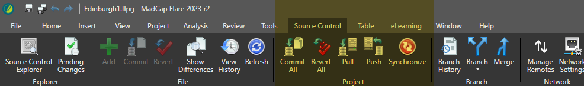
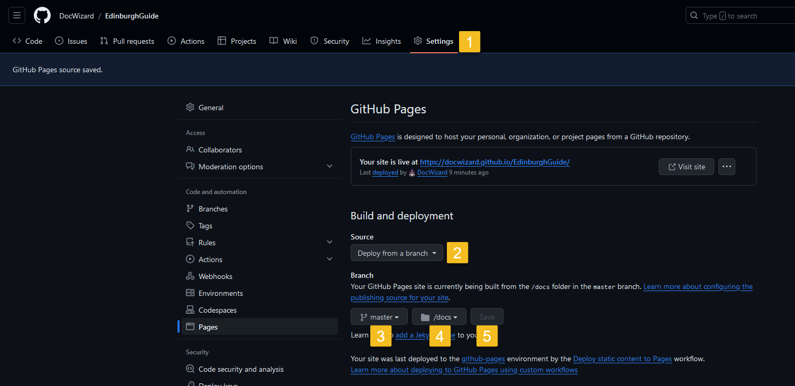

# Publikacja outputu z MadCap Flare w Github Pages

## Wersja z integracją MCF z GitHubem. 
### [Tu dostępny wariant łatwiejszy w konfiguracji, wykorzystujący GitHub Desktop](./README2.md)

## Krok 1. Jeśli nie mamy jeszcze zainstalowanego Gita &mdash; należy go ściągnąć i zainstalować. [LINK](https://git-scm.com/downloads). 

> [!IMPORTANT]
> GitHub Desktop to nie to samo, co Git!

## Krok 2. Łączymy projekt z repo w GitHubie. [Tu jest doskonała dokumentacja (LINK)](https://docsy-site.netlify.app/docs/madcap-flare/connect-madcap-to-git/#bind-using-the-flare-interface)

> [!CAUTION]
> Przechodzimy przez wszystkie kroki z powyższego tutoriala do punktu 'Upload your Madcap project to GitHub using VS Code'. Nie ma potrzeby łączenia VS Code z GitHubem!
>
> Powyższy tutorial nie uwzględnia momentu, w którym MCF prosi o login i hasło do GitHuba. Gdy pojawi się takie okno dialogowe, należy podać te dane.

## Krok 3. Przygotowanie projektu do publikacji w GitHub Pages:

### Najpierw przechodzimy przez poniższe kroki, by zmienić format outputu - zależy nam, by główna strona projektu nazywała się 'index.html':
<kbd></kbd>

### Następnie tworzymy nowy publishing destination, przechodząc poniższe kroki:

<kbd></kbd>
<kbd></kbd>
> [!CAUTION] 
> W tym przypadku folder docelowy musi nazywać się 'Docs' i być w głównym katalogu projektu, który bindujemy z Gitem. Jeśli projekt (i jednocześnie nasze repozytorium) mamy w folderze C:\Github\ProjektZaliczeniowy, to folder docelowy ustawiamy jako C:\Github\ProjektZaliczeniowy\Docs.
>
> Pilnujemy wielkich liter w nazwie folderu! Jeśli piszemy 'Docs', to konsekwentnie wszędzie indziej do folderu musimy się odwoływać wielką literą. Jeśli 'docs', to małą.

<kbd></kbd>
<kbd></kbd>

Następnie z poziomu MCF możemy kliknąć PUBLISH. Output z naszą gotową stroną powinien wpaść do przed chwilą wybranego folderu.

Od tego momentu w menu "Source Control" (na samej górze, w pasku zadań) mamy też standardowe operacje Gitowe - commit, pull, push. W praktyce, do większości celów wystarczy nam opcja 'publish'.

<kbd></kbd>

## Krok 4. Projekt gotowy do publikacji

W targecie HTML5 robimy Publish:

<kbd></kbd>

Cały projekt powinien wpaść do naszego, utworzonego w kroku 2. repozytorium. Zaglądamy tam teraz, wchodząc na stronę repozytorium w serwisie GitHub.

>[!TIP]
>Warto sprawdzić dwie rzeczy:
> * Czy na pewno mój output HTML trafia do folderu Docs?
>
> * Czy na pewno w folderze Docs znajduje się plik index.html? 

##  Krok 5. Publikacja w GitHub Pages

Ustawiamy GitHub Pages:

<kbd>

>[!NOTE]
> Interfejs GitHub Pages pozwala nam tu wyłącznie na wybranie folderu /docs pisanego małą literą, ale w praktyce - opublikuje także z /Docs. Wyjątkowo nie przejmujemy się wersalikami. 

Jeśli pojawią się błędy przy publikacji, możliwe że defaultowe ustawienia GitHub Pages nie radzą sobie z wybranym przez nas template. W takim wypadku ustawiamy jako source 'GitHub Actions', a nie 'Deploy from a Branch':

(Kliknij, by zobaczyć jak ustawić GitHub Actions)

  
<kbd></kbd>

Następnie musimy wybrać odpowiedni workflow:

<kbd></kbd>
<kbd></kbd>
<kbd></kbd>
<kbd></kbd>
<kbd></kbd>
<kbd></kbd>
<kbd></kbd>
<kbd></kbd>

## Krok 6. Finisz 🚀🚀🚀
Teraz, każdorazowo po wprowadzeniu w naszym projekcie w MCF zmian które chcemy opublikować na stronie, ponawiamy krok 4, czyli publish HTML5 output. Jeśli wszystko poszło zgodnie z planem, to za chwilę output powinien się pojawić na stronie.

<kbd></kbd>
