# Jak opublikować output z MadCap Flare w GitHub Pages.

## Krok 1A - Co zrobić w MCF:

<kbd>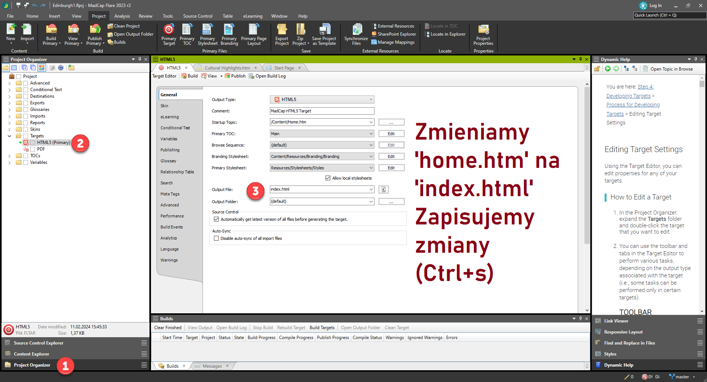</kbd>

*Teoretycznie* to wystarczy. Teraz każdorazowo po wprowadzeniu zmian w projekcie możemy kopiować zawartość folderu ./Output/{user}/HTML5 do naszego gitowego repozytorium. Tracimy możliwość automatyzacji tego procesu, ale jeśli komuś bardzo zależy na czasie, albo — zwyczajnie po ludzku — mu się nie chce, to jest to możliwa opcja. W tym wypadku przechodzimy od razu do kroku 4.

## Krok 1B - Co zrobić w MCF: Wersja z integracją MCF z GitHubem. Robimy to, co wyżej, plus:

## Krok 2 - łączymy projekt z repo w GitHubie. [Tu jest doskonała dokumentacja (LINK)](https://docsy-site.netlify.app/docs/madcap-flare/connect-madcap-to-git/#bind-using-the-flare-interface)

> [!CAUTION]
> Robimy wszystko z powyższego tutoriala do punktu 'Upload your Madcap project to GitHub using VS Code'. Nie ma potrzeby łączenia VS Code z GitHubem!

Od tego momentu w menu "Source Control" (na samej górze, w pasku zadań) mamy standardowe operacje Gitowe - commit, pull, push. Po zmianach w projekcie robimy commity, a następnie pushujemy. Znacie to już z zajęć :)

## Krok 3 - gdy już mamy podłączone repozytorium, tworzymy nowy output destination:

<kbd>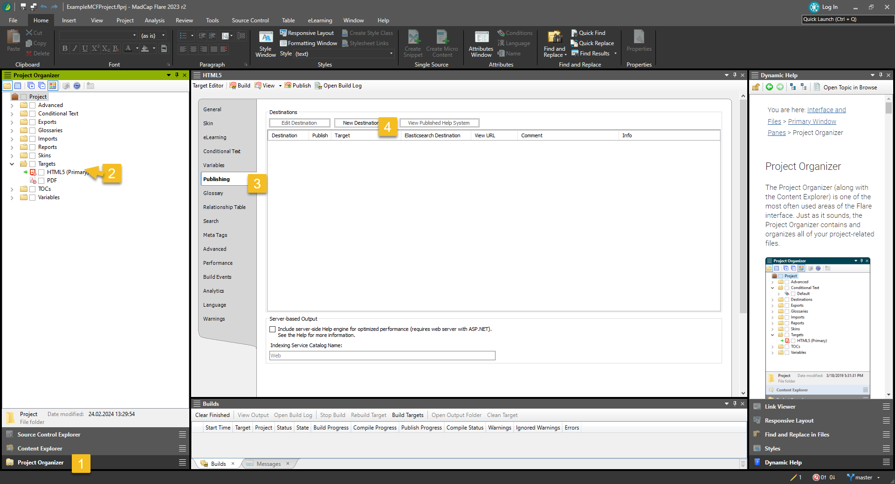</kbd>
<kbd>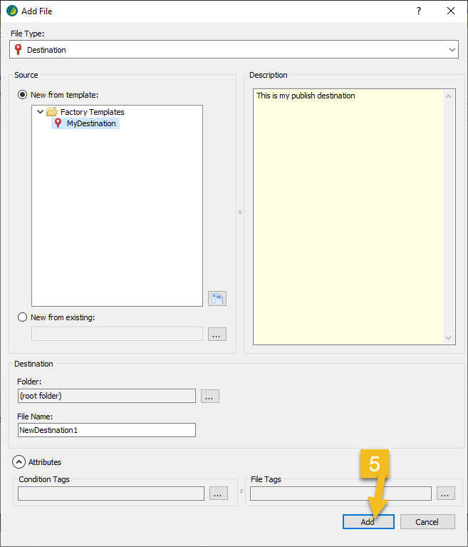</kbd>
<kbd>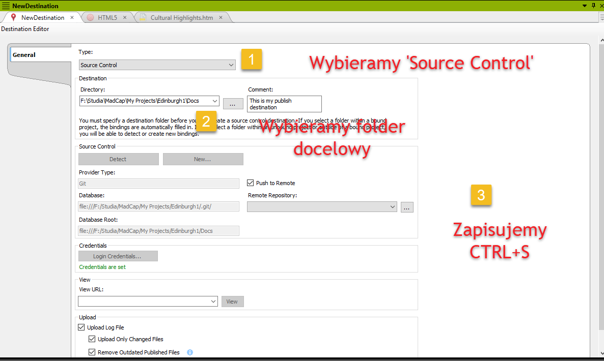</kbd>

> [!CAUTION] 
> Uwaga - folder docelowy musi nazywać się 'docs' i być w głównym katalogu  repozytorium. Czyli jeśli repozytorium mamy w folderze C:\Github\Repozytorium, to folder docelowy ustawiamy jako C:\Github\Repozytorium\docs.

<kbd></kbd>

##  Krok 4 - Co zrobić w GitHubie

Na tym etapie powinniśmy mieć stworzone repozytorium w GitHubie - albo z poziomu MCF, albo utworzone ręcznie (gdzie będziemy sami, ręcznie wkładać output).

>[!TIP]
>Warto sprawdzić dwie rzeczy:
>
> * Czy na pewno mój output HTML znajduje się w folderze Docs? (Nie dotyczy, jeśli wrzucamy pliki do repo ręcznie)
>
> * Czy na pewno w folderze Docs znajduje się plik index.html, a nie 'home.htm'? 

Gdy mamy już repozytorium z naszym outputem, otwieramy je z poziomu serwisu GitHub. Ustawiamy GitHub Pages:.
<kbd>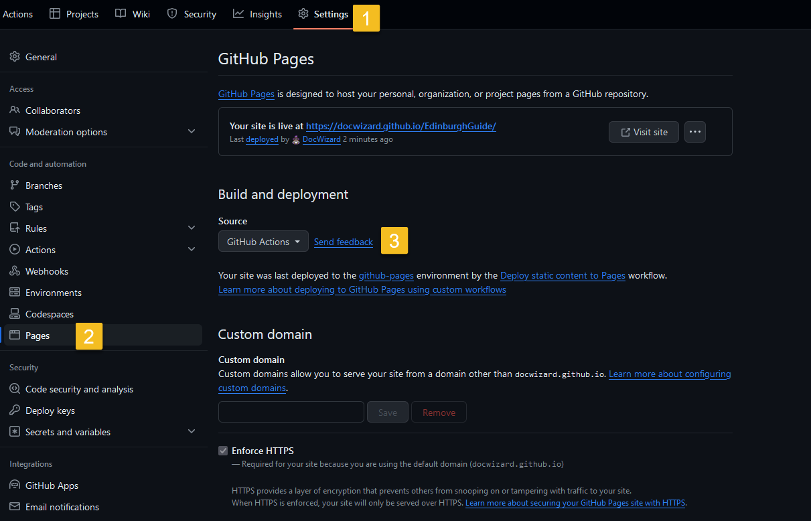</kbd>

> [!CAUTION]
> Uwaga - robimy to inaczej, niż gdy wrzucaliśmy dokumenty w markdownie. Wybieramy jako source 'GitHub Actions', a nie 'Deploy from a Branch'

Następnie musimy wybrać odpowiedni workflow:

<kbd>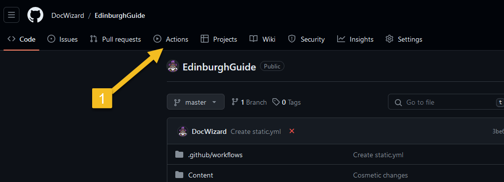</kbd>
<kbd>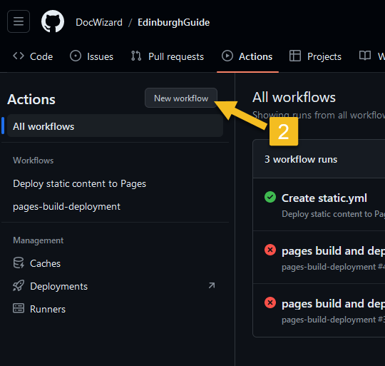</kbd>
<kbd>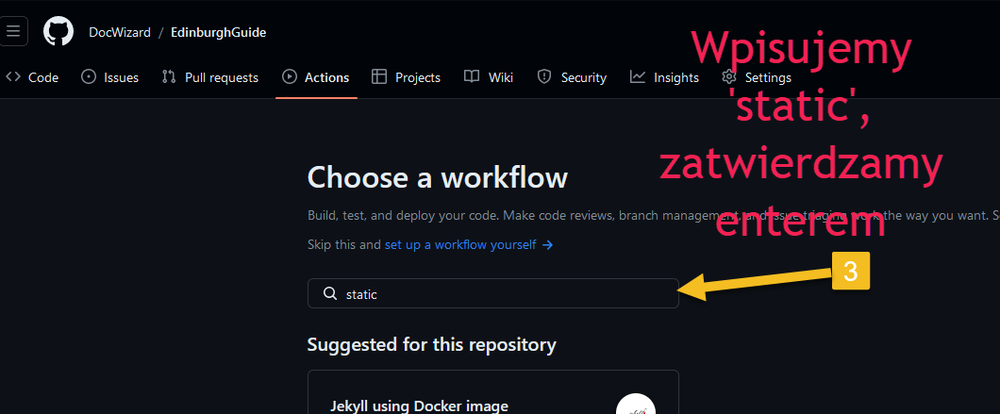</kbd>
<kbd>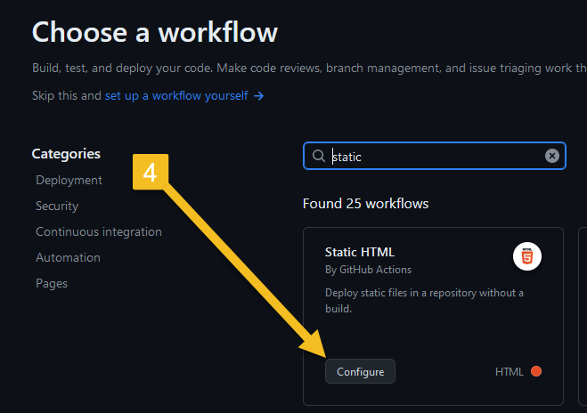</kbd>
<kbd>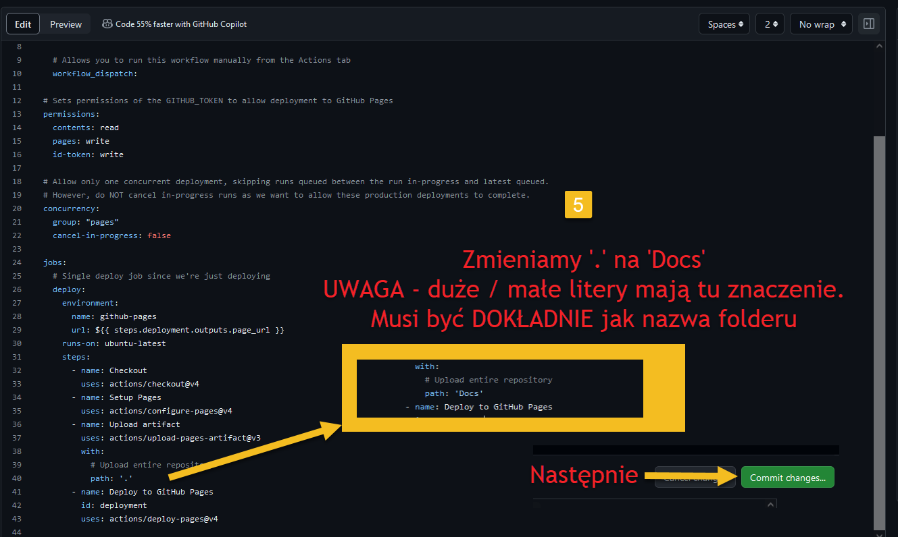</kbd>
<kbd>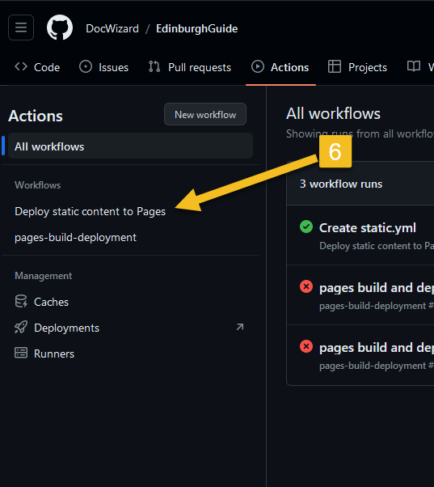</kbd>
<kbd></kbd>
<kbd>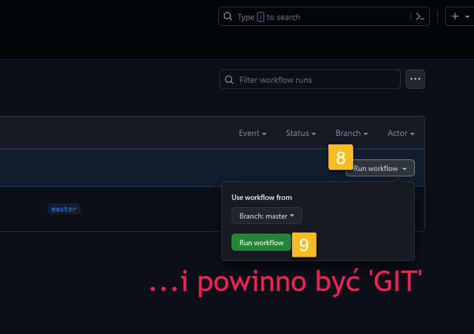</kbd>

Jeśli wszystko poszło zgodnie z planem, to za chwilę output powinien się pojawić w deployments. 
