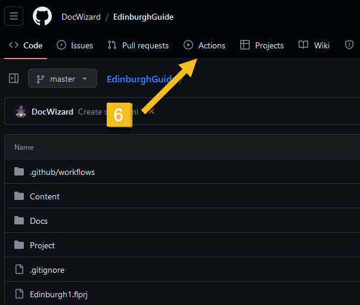

# GHPages-howto

# Jak opublikować output z MadCap Flare w GitHub Pages.

# Co zrobić w MCF:

# Co zrobić w MCF: Wersja z GitHubem. Robimy to, co wyżej, plus:

# Krok 1 - łączymy projekt z repo w GitHubie. [Tu jest doskonała dokumentacja (LINK)](https://docsy-site.netlify.app/docs/madcap-flare/connect-madcap-to-git/#bind-using-the-flare-interface)

# Krok 2 - gdy już mamy repozytorium, robimy nowy output destination:

# Co zrobić w GitHubie

## Najpierw tworzymy sobie repozytorium, gdzie wrzucamy całą zawartość folderu output z MCF. To jest ten folder, gdzie mamy plik index.html. Przykładowo u mnie to jest F:\MadCap\My Projects\Edinburgh\Output\maciej\HTML5

## Gdy już mamy repozytorium z wkładem, otwieramy je sobie z poziomu serwisu GitHub. Ustawiamy GitHub Pages - to umiemy. Settings -> Pages -> Deploy from a branch. (Tutaj ustawiamy też wcześniej wybrany output destination. U mnie tak: )

(Prawdopodobnie powinno działać też jeśli wybierzemy jako source 'GitHub Actions', ale przyznam, że jeszcze nie testowałem.)

## Następnie klikamy po kolei:

