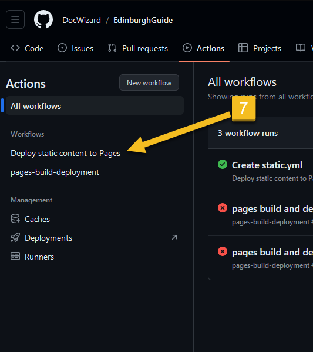

# GHPages-howto

# Jak opublikować output z MadCap Flare w GitHub Pages.

# Co zrobić w MCF:

# Co zrobić w GitHubie

## Najpierw tworzymy sobie repozytorium, gdzie wrzucamy całą zawartość folderu output z MCF. To jest ten folder, gdzie mamy plik index.html. Przykładowo u mnie to jest F:\MadCap\My Projects\Edinburgh\Output\maciej\HTML5

## Gdy już mamy repozytorium z wkładem, otwieramy je sobie z poziomu serwisu GitHub. Ustawiamy GitHub Pages - to umiemy. Settings -> Pages -> Deploy from a branch. 
(Prawdopodobnie powinno działać też jeśli wybierzemy jako source 'GitHub Actions', ale przyznam, że jeszcze nie testowałem.)

## Następnie klikamy po kolei:

