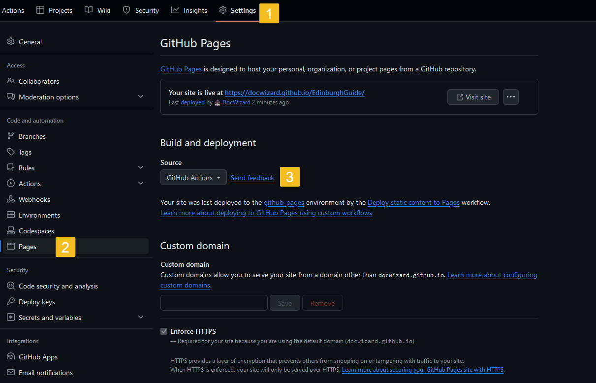

# Ręczne publikowanie z MCF do GitHub za pomocą GitHub Desktop.

Przygotowanie projektu do publikacji w GitHub Pages:

## Krok 1: Z poziomu GitHub Desktop tworzymy nowe, puste repozytorium.

<kbd>
<kbd>

### Otwieramy folder, w którym znajduje się nasze nowe repozytorium. Zapisujemy sobie ścieżkę dostępu - w przypadku tego tutoriala, F:\Studia\MCF_test.

## Krok 2: Przygotowujemy projekt do publikacji.

### Otwieramy projekt w MadCap Flare. Najpierw przechodzimy przez poniższe kroki, by zmienić format outputu - zależy nam, by główna strona projektu nazywała się 'index.html':
<kbd></kbd>

### Następnie tworzymy nowy publishing destination, przechodząc poniższe kroki:

<kbd></kbd>
<kbd></kbd>
<kbd></kbd>
<kbd></kbd>

### <kbd>CTRL+SHIFT+S</kbd>, upewniamy się, że wszystkie zmiany zostały zachowane. Następnie wybieramy "publish HTML5":

### Zaglądamy do folderu z repozytorium. Powinny się tam pojawić pliki z naszą stroną w HTML-u:

<kbd></kbd>

>[!CAUTION]
> Jeśli nie, sprawdzamy jeszcze raz czy przy tworzeniu publishing destination podaliśmy właściwy folder, czy na pewno zapisaliśmy wszystkie zmiany, oraz czy publishing się udał. 
>[!CAUTION]
> Sprawdzamy też, czy na pewno mamy plik index.html. Jeśli nie, wykonujemy kroki z pierwszego zrzutu ekranu (tj. początek kroku 2)!

## Krok 3: Otwieramy GitHub Desktop:

Strona jest gotowa do wrzucenia do serwisu GitHub. Sprawdzamy, czy GitHub Desktop widzi nasze zmiany - powinny wyświetlić się po lewej stronie. Jeśli tak, robimy commit:

<kbd></kbd>

Następnie klikamy "Publish repository.":

<kbd></kbd>
<kbd></kbd>

## Krok 4: GitHub Pages:

Ustawiamy GitHub Pages:

<kbd>

Wracamy do głównej strony naszego repozytorium i czekamy na build. Żółta kropka oznacza, że projekt się jeszcze przetwarza. Zielona - wszystko gotowe. Wtedy przechodzimy od razu do kroku 5.

<kbd>

Jeśli pojawią się błędy przy publikacji - czerwony krzyżyk -  możliwe że defaultowe ustawienia GitHub Pages nie radzą sobie z wybranym przez nas template. W takim wypadku ustawiamy jako source 'GitHub Actions', a nie 'Deploy from a Branch', wykonując poniższe kroki:

<kbd></kbd>

Następnie musimy wybrać odpowiedni workflow:

<kbd></kbd>
<kbd></kbd>
<kbd></kbd>
<kbd></kbd>
<kbd></kbd>
<kbd></kbd>
<kbd></kbd>
<kbd></kbd>

## Krok 5: Sukces!

### Zaglądamy na naszą nowoopublikowaną stronę, sprawdzamy czy wszystko wygląda tak, jak powinno:

<kbd>
<kbd>

### Wszystko gotowe. Od teraz, za każdym razem gdy chcemy wrzucić nową wersję naszego projektu na GitHub, najpierw robimy Publish w MadCap Flare, a następnie przez GitHub Desktop — commit i push:

